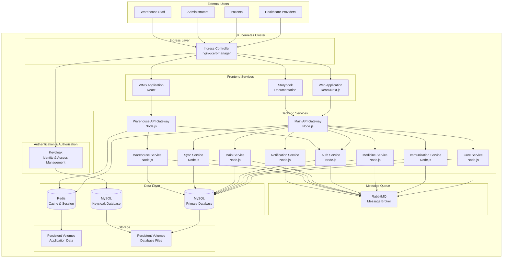
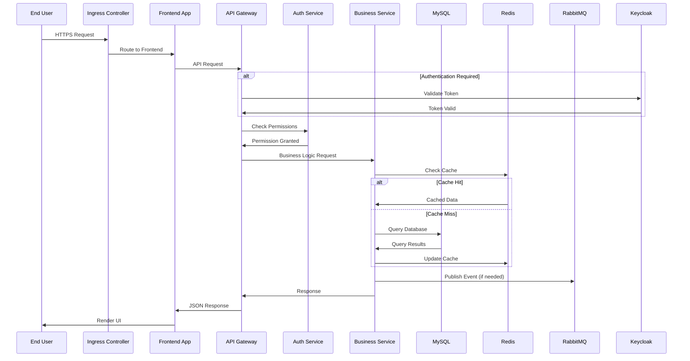
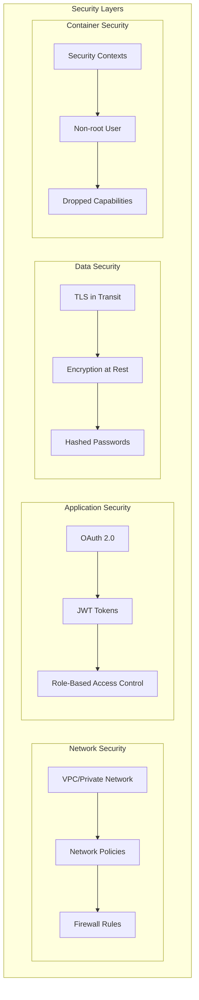

# Smile Health Architecture Diagram

This document provides a comprehensive architectural overview of the Smile Health application deployed via Helm charts on Kubernetes.

## Overview

The Smile Health platform is a microservices-based healthcare management system consisting of multiple backend services, frontend applications, and supporting infrastructure components.

## High-Level Architecture

## Service Communication Flow

## Infrastructure Components

### 1. Ingress Layer
- **NGINX Ingress Controller**: Routes external traffic to internal services
- **Cert-Manager**: Manages TLS certificates automatically
- **Rate Limiting**: Protects against DDoS attacks
- **Path-based Routing**: Routes to different services based on URL path

### 2. Frontend Services
- **Web Application**: Main patient and provider portal
- **WMS Application**: Warehouse management system
- **Storybook**: Component documentation and testing

### 3. Backend Services
- **Core Service**: Central business logic and user management
- **Immunization Service**: Vaccine tracking and scheduling
- **Medicine Service**: Pharmaceutical inventory management
- **Auth Service**: Authentication and authorization
- **Main Service**: Primary application logic
- **Sync Service**: Data synchronization between systems
- **Warehouse Service**: Inventory and logistics management
- **API Gateways**: Request routing and aggregation
- **Notification Service**: Email, SMS, and push notifications

### 4. Authentication Layer
- **Keycloak**: 
  - Single Sign-On (SSO)
  - OAuth 2.0 / OpenID Connect
  - User federation
  - Role-based access control (RBAC)

### 5. Message Queue
- **RabbitMQ**:
  - Asynchronous communication
  - Event-driven architecture
  - Message durability
  - Load balancing

### 6. Data Layer
- **MySQL**: Primary relational database
- **Redis**: Caching, session storage, and pub/sub
- **Persistent Volumes**: Durable storage for databases

## Deployment Architecture

### Service Discovery

All services communicate using Kubernetes internal DNS:
- Format: `{service-name}.{namespace}.svc.cluster.local`
- Example: `smile-health-core.smile-health.svc.cluster.local`

### Load Balancing

- **Internal Load Balancing**: Kubernetes Services distribute traffic within the cluster
- **External Load Balancing**: Ingress controller manages external traffic distribution
- **Database Load Balancing**: MySQL master-slave configuration for read scaling

## Security Architecture

## Monitoring and Observability

### Health Checks
- **Liveness Probes**: Check if service is running
- **Readiness Probes**: Check if service is ready for traffic
- **Startup Probes**: Check if service has started

### Metrics Collection
- **Application Metrics**: Custom business metrics
- **Infrastructure Metrics**: CPU, memory, network, disk
- **Kubernetes Metrics**: Pod, service, and cluster metrics

### Logging Architecture
- **Application Logs**: Structured JSON logs
- **Access Logs**: HTTP request/response logs
- **System Logs**: Kubernetes events and audit logs

## Scalability Patterns

### Horizontal Scaling
- **Stateless Services**: Can be scaled horizontally
- **API Gateways**: Load balance across multiple instances
- **Frontend Applications**: Multiple replicas for availability

### Vertical Scaling
- **Database**: Increase resources for MySQL and Redis
- **Message Queue**: Scale RabbitMQ based on message throughput

### Auto-scaling
- **HPA (Horizontal Pod Autoscaler)**: Scale based on CPU/memory
- **VPA (Vertical Pod Autoscaler)**: Adjust resource requests
- **Cluster Autoscaler**: Add/remove nodes based on demand

## Disaster Recovery

### Backup Strategy
- **Database Backups**: Regular MySQL dumps
- **Volume Snapshots**: Persistent volume backups
- **Configuration Backup**: Git-based configuration storage

### High Availability
- **Multi-replica Deployment**: Services run across multiple nodes
- **Database Replication**: Master-slave MySQL configuration
- **Failover Mechanisms**: Automatic pod restart and rescheduling

### Recovery Procedures
- **Rollback Capability**: Helm rollback to previous versions
- **Blue-Green Deployment**: Zero-downtime updates
- **Canary Releases**: Gradual rollout of new versions

## Development vs Production

### Development Environment
- Single replica for most services
- Minimal resource allocation
- Local database instances
- Debug tools enabled

### Production Environment
- Multiple replicas for high availability
- Resource limits and requests configured
- External managed databases
- Monitoring and alerting enabled
- Network policies enforced
- TLS certificates mandatory
